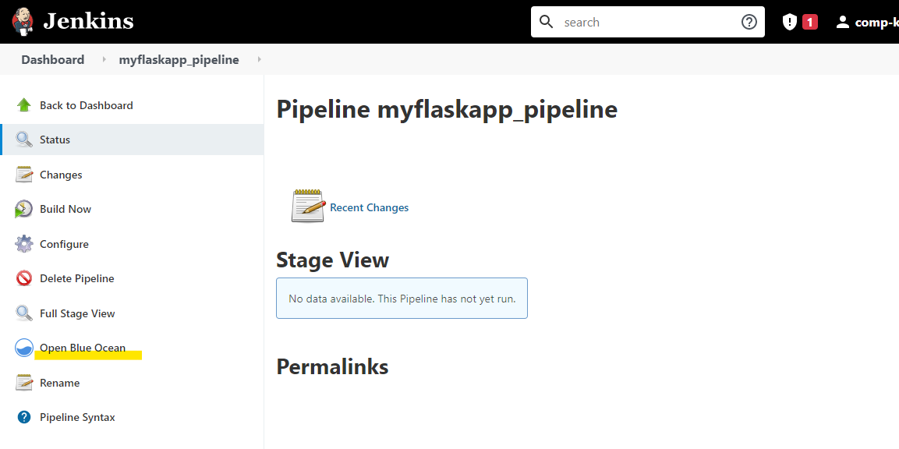

# Running the pipeline

Click "Open Blue Ocean" on the left to access Jenkins’s Blue Ocean interface.

Click "Run".

Click the "run 1" to examine the process.

Click the "build" stage. Expand the steps to view the console log of each of the steps.

Click the "test" stage. Expand the steps to view the console log of each step.

